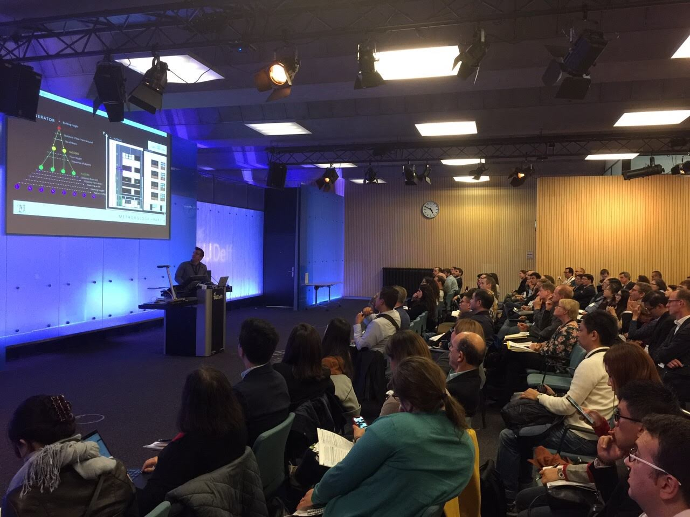

	The conference has been a great success. Thanks for coming and see you in <a href="https://www.3dgeoinfo2019.com/" style="color: #30bfeb;">Singapore</a>!

<b>Recent news</b>  
	
  
  	
<small>{{ news.date | date: "%b %d" }}</small> {{ news.news }}

  
  <a href="news.html">All news</a>

We were glad to host the 2018 3D GeoInfo Conference in Delft, Netherlands! Aiming to bring together international researchers from academia, industry and government in the field of 3D geoinformation, the conference offered an interdisciplinary forum to researchers in the fields of data collection, advanced modelling approaches, data analysis and visualisation.

The conference focused on developments and applications in advanced 3D data and technologies, as well as provided a platform for these topics to be discussed and for research ideas to be exchanged. There were also opportunities to promote international collaboration in geoinformation, 3D data analysis and visualisations. The conference was part of the joint event [Geo Delft 2018](https://www.tudelft.nl/geodelft2018/), which took place October 1-5, 2018.

<!-- In case of general questions, you can contact [us](mailto:info@3dgeoinfo2018.nl). -->

<!--   -->