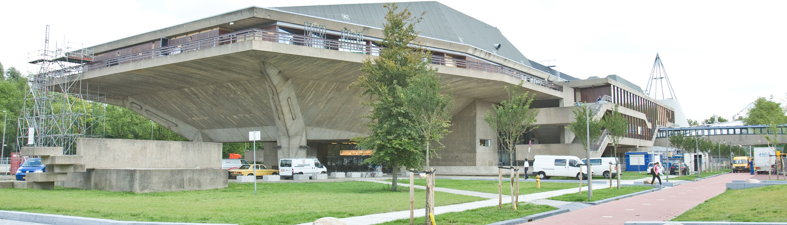

## Practical information

### Venue

The conference will be held at the Aula Congress Centre of the Delft University of Technology.
The 3D GeoInfo presentations will be taking place at the Senaatzaal and the plenary sessions at the Auditorium.
The Aula Congress Centre is located just south of the city centre of Delft, easily accessible as a 20-minute walk from the central square of Delft (the <i>Markt</i>), or by walking (20 minutes) or taking public transit (5 minutes) from the Delft train station.
It is also reachable by car through the A13 highway (take exits 9 - Delft or 10 - Delft Zuid).

	

	

		<strong><a href="https://www.tudelft.nl/en/about-tu-delft/contact-and-accessibility/map-and-buildings/building-20/">Aula Congress Centre</a></strong>
		<address>
			Mekelweg 5  
			2628 CC Delft  
		</address>
	

 

  

 

**From the city centre**: The Aula Congress Centre is within walking distance of the city centre. Just walk southwards, cross the large bridge (the <i>Sint Sebastiaansbrug</i>) and keep going south for 10 more minutes.
The building will be on your left.
Maps: [Google](https://www.google.com/maps/place/Delft+University+of+Technology+Auditorium+Conference+Center/@52.0021289,4.3711095,17z/data=!3m1!4b1!4m5!3m4!1s0x47c5b5929cb28153:0xd5b81144a89ac9a7!8m2!3d52.0021256!4d4.3732982) or [Apple](https://maps.apple.com/?ll=52.002199\,4.373416&q=Aula%20Congress%20Centre&_ext=EiQpxhyDfFz/SUAxIASYwAlcEUA5P9PNSQ8CSkBBIBKYwFGbEUA%3D&t=r).

**From the Delft train station**: The Aula Congress Centre is a 20-minute walk from the station.
Alternatively, buses 40 (Rotterdam Centraal), 55 (Zoetermeer Centrum West), 69 (Delft Technopolis) and 174 (Rotterdam Noord via Berkel) will drop you off at the stop TU - Aula just in front of the venue.
It is the third stop. [Here](https://www.connexxion.nl/data/upload/Lijnennetkaart%20Delft.pdf) is a public transit map of the area.

### About Delft

Delft is a small university city located about 60 km south-west of Amsterdam, very close to The Hague and Rotterdam.
It is a lovely city with a rich history, famous for its canals, Delft Blue pottery (Delftware), the painter Johannes Vermeer, and its association with the Dutch royal family.
You can read more about the city and its attractions in the [website](https://www.delft.com) of the municipality of Delft.

 

### Getting to Delft

Delft is well connected to the rest of the Netherlands by frequent trains, including from the Hague (6 minutes from HS, 12 minutes from Centraal), Rotterdam (10-12 minutes from Centraal), Schiphol Airport (38 minutes), or Amsterdam (45 minutes from Zuid, 1 hour from Centraal).
From other countries, it is very easy to get to Delft by flying to Amsterdam Schiphol Airport (AMS) or Rotterdam The Hague Airport (RTM).
It is also close to the ferry terminal in Hoek van Holland (for ferries to United Kingdom).
Other less convenient options include the airports in Brussels (BRU) and Eindhoven (EIN).

	

 

**Flying to Amsterdam**: Schiphol Airport is 50 km north-east of Delft and has excellent connections to Europe and the rest of the world.
From the airport, you can take a direct train to Delft every 30 minutes during the day and every hour during the night.
The train takes 38 minutes.

**Flying to Rotterdam**: Rotterdam The Hague Airport is 10 km south of Delft and has connections to several airports in Europe.
From the airport, you can take a bus towards Rotterdam Central Station, then a train or bus to Delft.
The combined trip takes roughly 40 minutes.

### Accommodation

The most convenient option is to stay in a hotel in the Delft city centre, from which you can walk to the <a href="#venue">venue</a>.
Staying elsewhere in Delft is slightly less convenient since you might need to take public transit or cycle to reach the venue.
Staying in a nearby city (such as the Hague or Rotterdam) and taking the train to Delft is possible as well.
The Delft train station is a 20-minute walk from the venue.

<a href="https://www.preferredreservations.nl/geo-delft-conference">Preferred Hotel Reservations</a> is the official provider of accommodation for the Geo Delft 2018 conference.
However, you will likely find better deals by booking through your usual hotel reservations website.

### Visa

If you have already registered for the conference and need an invitation letter for a visa application, please contact <a href="mailto:info@3dgeoinfo2018.nl">us</a>.
Send us an e-mail with your name, date and place of birth, passport number and expiration date.